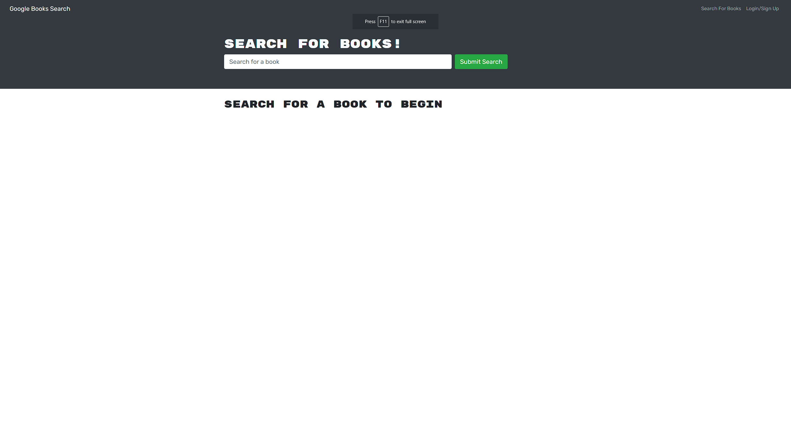
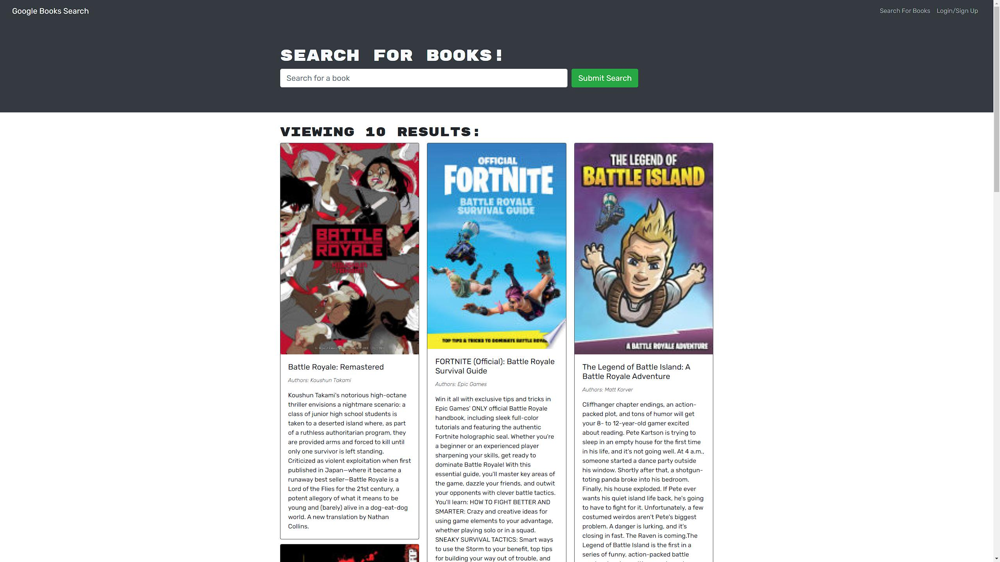
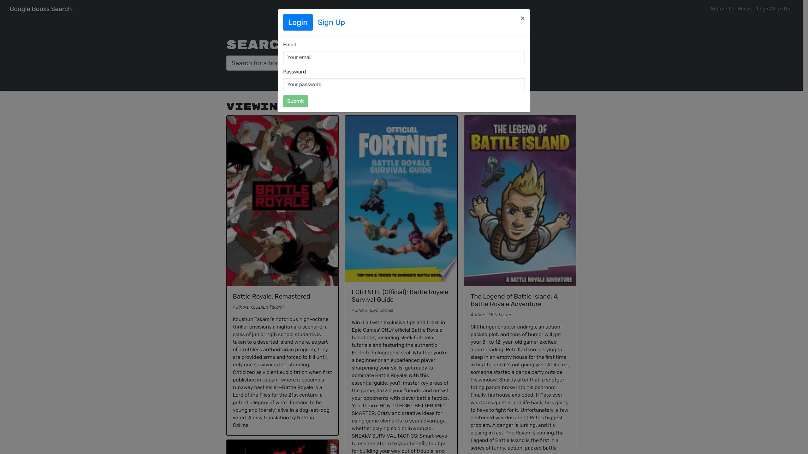
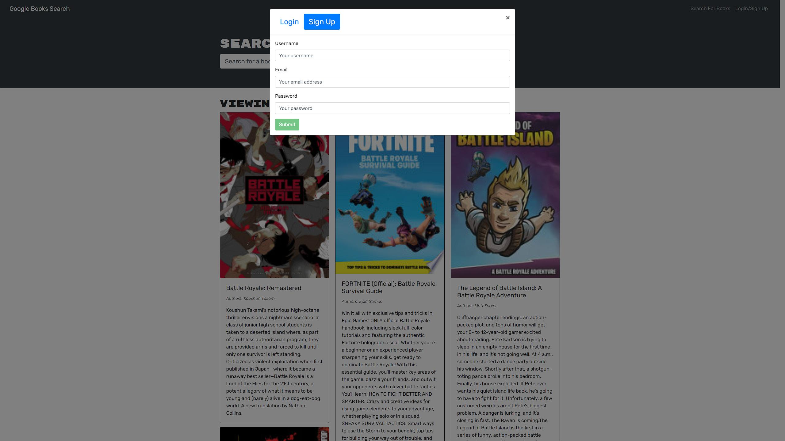
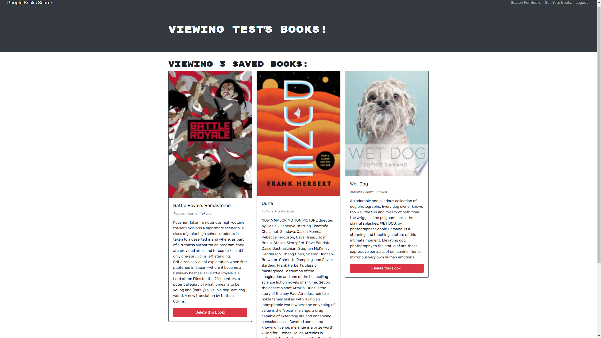

# React Book Search Engine 

## Description

This application is a Google Books API search engine that is built using the MERN stack, with a React front end, MongoDB database, and Node.js/Express server and API. It features a user database with login and signup functionality, password encryption, and allows the user to save and remove books to/from their account. The application is presented in a intuitive way that allows users to utilize the Google Books API to easily view books' information.

## Table of Contents

* [Usage](#usage)

* [License](#license)

* [Credits](#credits)

* [Questions](#questions)

## Usage

When the user visits the webpage, they are presented with a search bar, as the default page, as well as buttons to login or signup in the Navbar. Without logging in, the user is able to search for any book by using the search form, and they will be presented with various books based on title in relation to the search input. In addition to the title, each entry will also feature a description of the book, any authors, and an image of the book. If the user chooses to login or signup, a popup will appear prompting them to input their information. When logged in, after searching for a book, the user will also be able to save the book to their account. This will allow the user to see the book with any other books that have been saved on a separate page when they click on See Your Books in the Navbar. Here, any books that have been saved by the user will be rendered here, as well as the ability to remove them. Books that have been saved are account-specific, so different users may save different books. The user is able to log out as well, thus losing the ability to save and view saved books.

## License

This project is licensed under the MIT license.

## Credits

Google Books API

## Questions

If you have any questions about this repository, open an issue or contact me at jthnguyen9909@gmail.com. You can find more of my work at [jthnguyen9909](https://github.com/jthnguyen9909).
